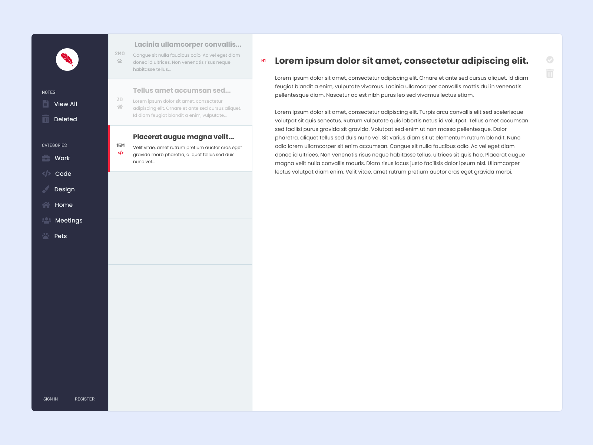

# Sonder - A note taking app

On the surface the App is a note taking app but my primary goal is to use this app to consolidate what I've learned about React into a single project. 

View a hosted demo here: https://sonder-581b0.web.app/

## Installing the and running the app

Sonder should run on localhost:3000 after installing and starting the app

`npm install`

`npm start`
